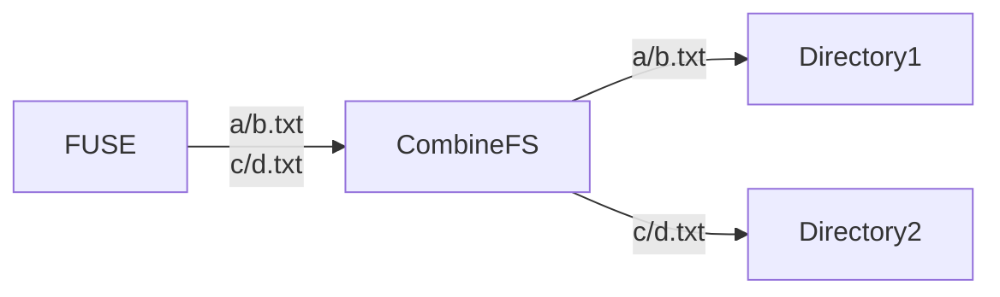

# CombineFS
Combine 2 or more directory into 1 fuse file system

This application only works with Linux (fuse)

## Usage

Currently, you have to edit `Program.cs` to change mount point and directory to combine files.
